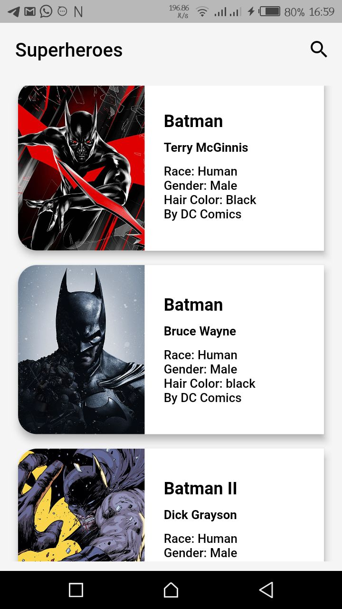
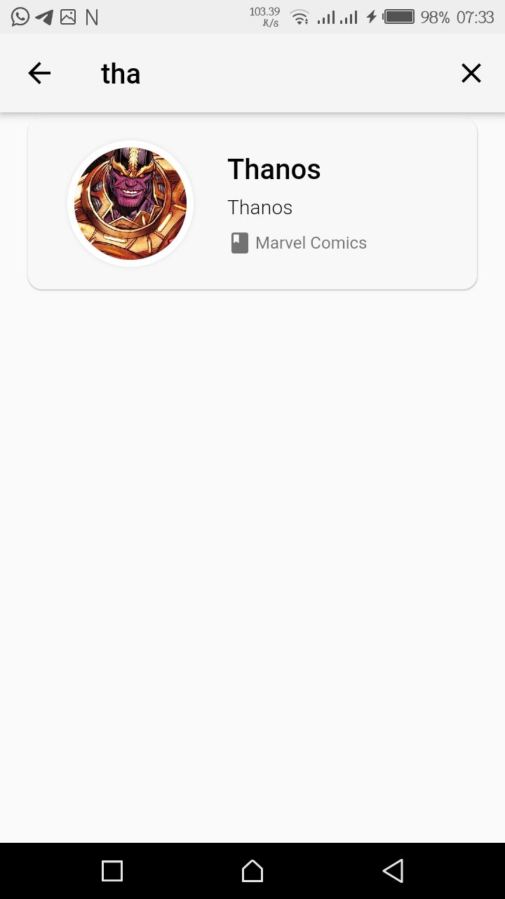
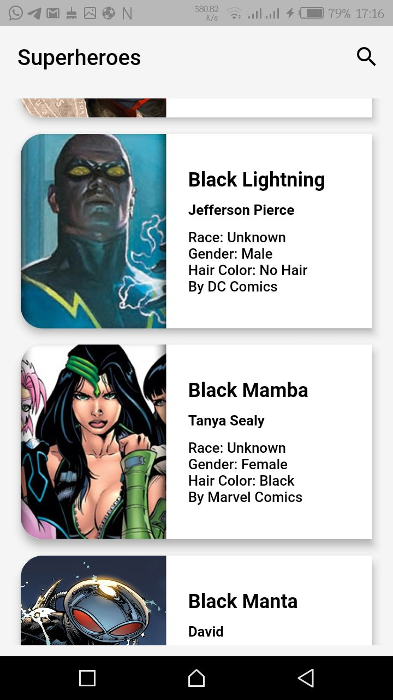
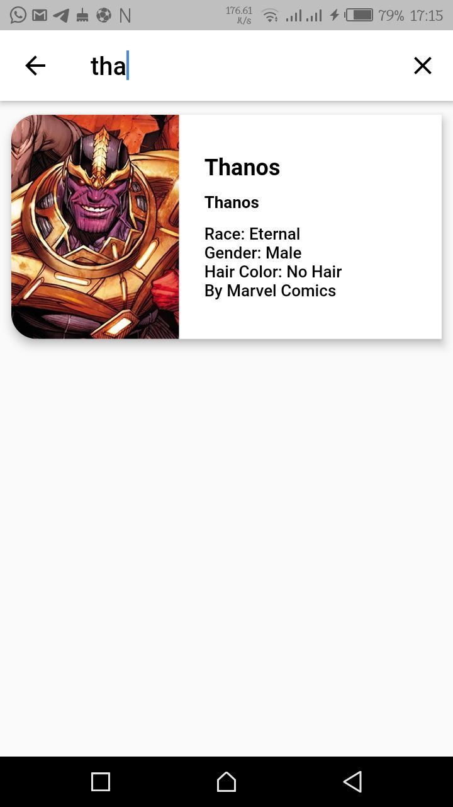
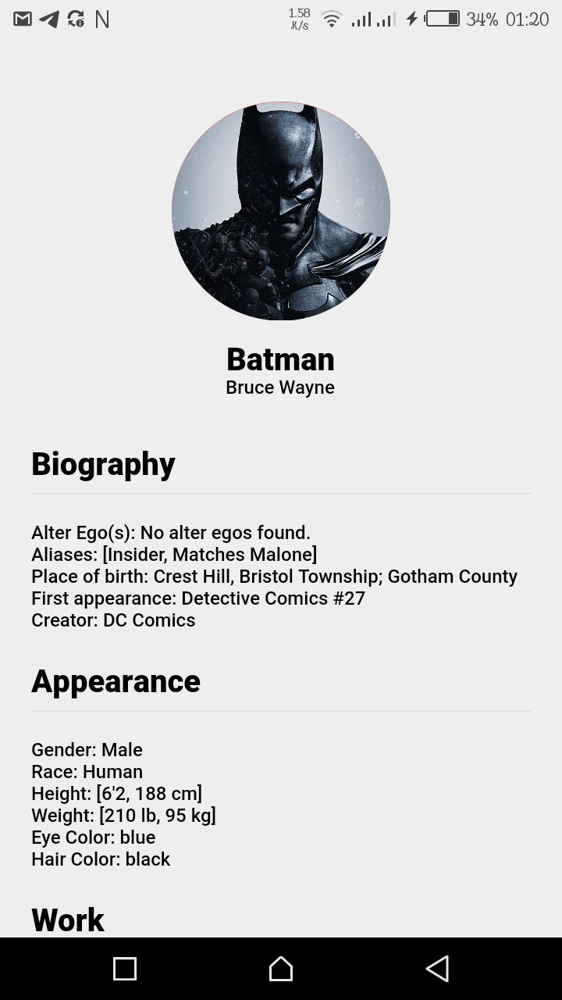
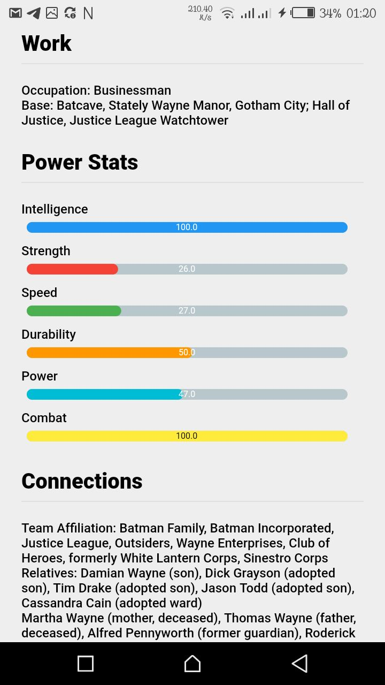

# 🤓 FlutterSuperHeroes   

A Flutter app that displays superheroes and villains from different universes

## 📸 ScreenShots

| 1 | 2|
|------|-------|
|||

| 3 | 4|
|------|-------|
|||

| 5 | 6|
|------|-------|
|||

## ✨ Requirements
* Any Operating System (ie. MacOS X, Linux, Windows)
* Any IDE with Flutter SDK installed (ie. IntelliJ, Android Studio, VSCode etc)
* A little knowledge of Dart and Flutter
* A brain to think 🤓🤓

## 🤓 Author(s)
**Olusegun Festus Babajide**

## ❗️ Disclaimer

[Superhero API](https://akabab.github.io/superhero-api/api/) was used in making this app.
Pardon my Bad English 😔

Give a ⭐️ if you like what you see.

## Getting Started

For help getting started with Flutter, view our 
[online documentation](https://flutter.dev/docs), which offers tutorials, 
samples, guidance on mobile development, and a full API reference.
